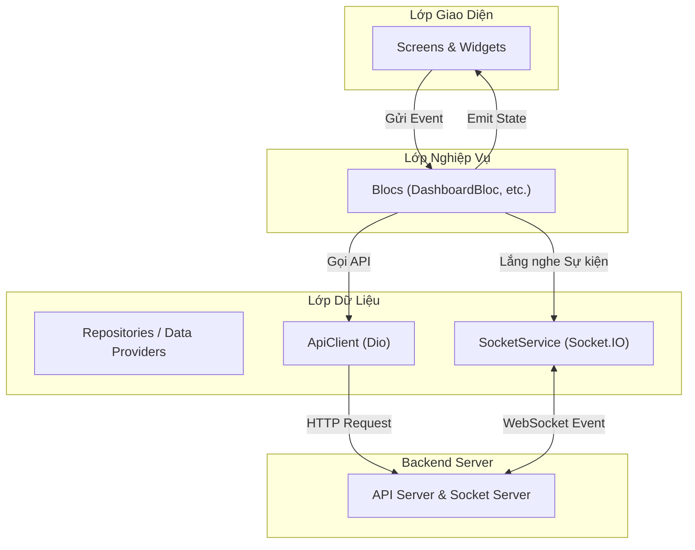
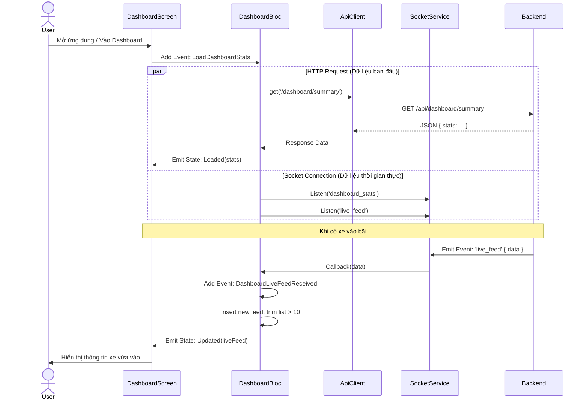

# TECHNICAL_DESIGN.md

## 1. Lý do chọn giải pháp

Bọn em lựa chọn bộ công nghệ (stack) này dựa trên các tiêu chí về hiệu năng, khả năng mở rộng và trải nghiệm người dùng:

*   **Flutter**:
    *   **Đa nền tảng**: Cho phép phát triển ứng dụng cho cả Web, Android và iOS từ một mã nguồn duy nhất, giúp tiết kiệm thời gian và chi phí bảo trì.
    *   **Hiệu năng cao**: Flutter biên dịch ra mã máy (native code) giúp ứng dụng chạy mượt mà, đặc biệt quan trọng cho các tính năng giám sát thời gian thực.
    *   **UI linh hoạt**: Hệ thống Widget phong phú giúp dễ dàng tùy biến giao diện hiện đại, responsive cho cả Desktop và Mobile.

*   **Flutter Bloc (Business Logic Component)**:
    *   **Quản lý trạng thái (State Management)**: Giúp tách biệt rõ ràng giữa giao diện (UI) và logic nghiệp vụ (Business Logic).
    *   **Dễ kiểm thử**: Các Bloc hoạt động dựa trên luồng sự kiện (Event) và trạng thái (State), dễ dàng viết unit test.
    *   **Predictable**: Luồng dữ liệu một chiều giúp dễ dàng theo dõi và debug trạng thái của ứng dụng.

*   **Dio**:
    *   Thư viện HTTP client mạnh mẽ cho Dart, hỗ trợ Interceptors (để log, xử lý lỗi chung), Global Configuration (Base URL, timeout) và xử lý dữ liệu JSON tự động.

*   **Socket.IO Client**:
    *   **Real-time**: Cung cấp kết nối WebSocket ổn định để nhận dữ liệu thời gian thực từ server (như xe ra vào, cập nhật thống kê) mà không cần phải polling liên tục, giảm tải cho server và tiết kiệm băng thông.

## 2. Sơ đồ kiến trúc phần mềm

Dự án tuân theo kiến trúc phân lớp (Layered Architecture) kết hợp với mô hình BLoC.

**Giải thích:**
*   **Presentation Layer**: Chứa các màn hình (Screens) và Widget. Chỉ chịu trách nhiệm hiển thị dữ liệu và nhận tương tác từ người dùng.
*   **Business Logic Layer**: Chứa các Bloc. Nhận sự kiện từ UI (ví dụ: `LoadDashboardStats`), xử lý logic, gọi xuống lớp dữ liệu và phát ra trạng thái mới (ví dụ: `DashboardLoaded`).
*   **Data Layer**:
    *   `ApiClient`: Xử lý các yêu cầu HTTP (GET, POST, PUT, DELETE).
    *   `SocketService`: Quản lý kết nối WebSocket và lắng nghe các sự kiện thời gian thực.

## 3. Giải thuật và Logic xử lý

### 3.1. Logic Dashboard Real-time
Màn hình Dashboard cần hiển thị số liệu thống kê và danh sách xe ra vào mới nhất (Live Feed) theo thời gian thực.

**Quy trình xử lý:**
1.  **Khởi tạo**:
    *   Khi `DashboardBloc` được khởi tạo, nó gọi `ApiClient.get` để lấy dữ liệu thống kê tổng quan (`DashboardStats`) hiện tại.
    *   Đồng thời, đăng ký lắng nghe 2 sự kiện từ Socket: `dashboard_stats` và `live_feed`.

2.  **Cập nhật Thống kê (`dashboard_stats`)**:
    *   Khi nhận được event `dashboard_stats` từ Socket (chứa số liệu mới, ví dụ: số lượng xe đang đỗ thay đổi).
    *   Bloc kích hoạt event `UpdateDashboardStats`.
    *   Bloc cập nhật state hiện tại với số liệu mới và emit state mới để UI cập nhật lại các con số.

3.  **Cập nhật Live Feed (`live_feed`)**:
    *   Khi nhận được event `live_feed` (thông tin xe vừa ra/vào).
    *   Bloc kích hoạt event `DashboardLiveFeedReceived`.
    *   **Thuật toán Queue giới hạn**:
        *   Lấy danh sách feed hiện tại.
        *   Chèn feed mới vào đầu danh sách (index 0).
        *   Kiểm tra kích thước danh sách: Nếu `length > 10`, xóa phần tử cuối cùng (`removeLast`).
        *   Emit state mới với danh sách feed đã cập nhật.

### 3.2. Xử lý Lỗi HTTP
*   Sử dụng `Dio Interceptor` hoặc `try-catch` trong `ApiClient`.
*   Nếu có lỗi mạng hoặc lỗi server (4xx, 5xx), ném ra ngoại lệ tùy chỉnh.
*   Bloc bắt ngoại lệ này và emit trạng thái `Error` để UI hiển thị thông báo lỗi (Snackbar hoặc màn hình lỗi).

## 4. Lược đồ tương tác người dùng

Dưới đây là ví dụ về luồng tương tác khi người dùng vào màn hình Dashboard.

## 5. Giao thức giao tiếp

Hệ thống sử dụng song song hai giao thức giao tiếp:

### 5.1. HTTP (RESTful API)
*   **Mục đích**: Sử dụng cho các thao tác CRUD (Create, Read, Update, Delete) không yêu cầu tính thời gian thực tức thì hoặc dữ liệu lớn.
*   **Định dạng**: JSON.
*   **Thư viện**: Dio.
*   **Cấu hình**:
    *   `Content-Type`: `application/json`
    *   Timeout: 10 giây.
*   **Các Endpoint chính** (Ví dụ):
    *   `GET /dashboard/summary`: Lấy thống kê tổng quan.
    *   `GET /residents`: Lấy danh sách cư dân.
    *   `POST /vehicles`: Đăng ký xe mới.

### 5.2. WebSocket (Socket.IO)
*   **Mục đích**: Truyền tải dữ liệu thời gian thực từ Server xuống Client (Server-Push).
*   **Thư viện**: `socket_io_client`.
*   **Transports**: `['websocket']` (Ưu tiên WebSocket native để giảm độ trễ).
*   **Các Sự kiện (Events)**:
    *   `connect`: Khi kết nối thành công.
    *   `disconnect`: Khi mất kết nối.
    *   `dashboard_stats`: Server gửi cập nhật số liệu thống kê (ví dụ: activeSessions).
    *   `live_feed`: Server gửi thông tin xe vừa check-in/check-out.
